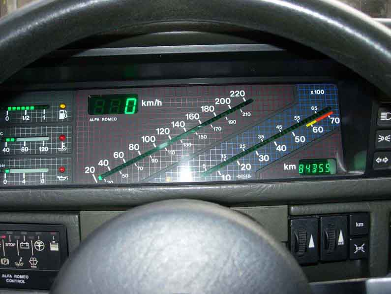
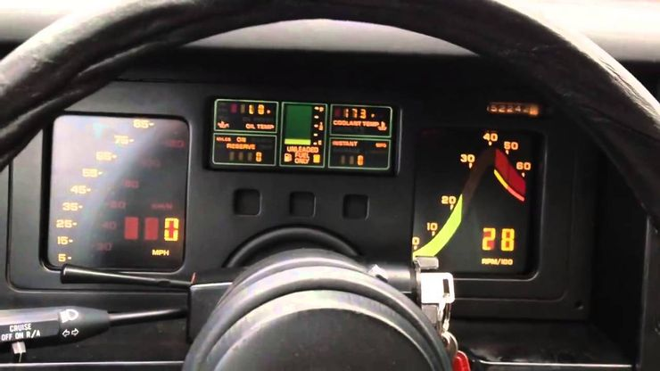
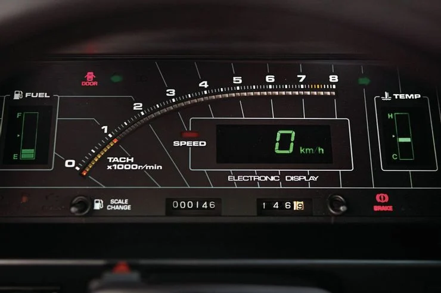
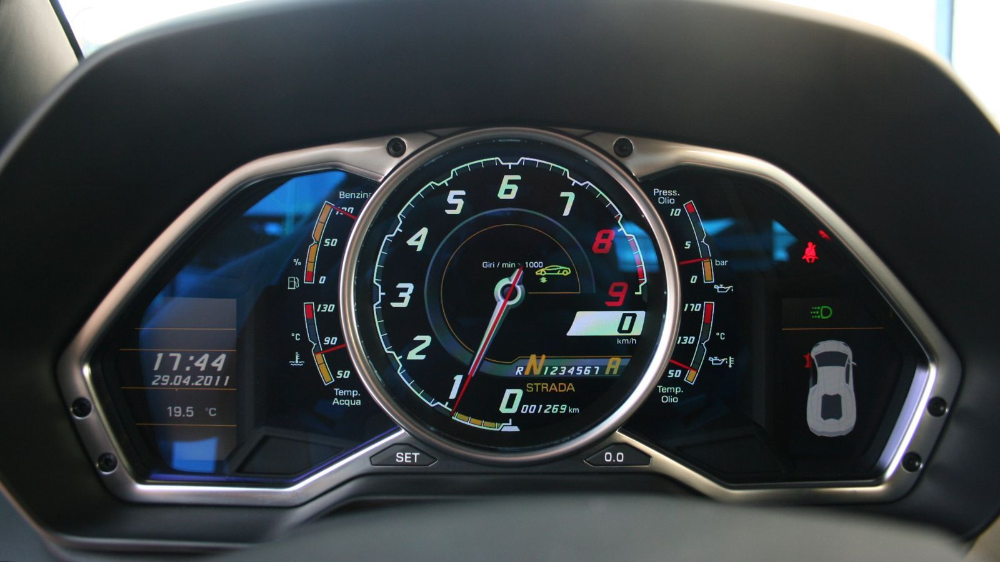
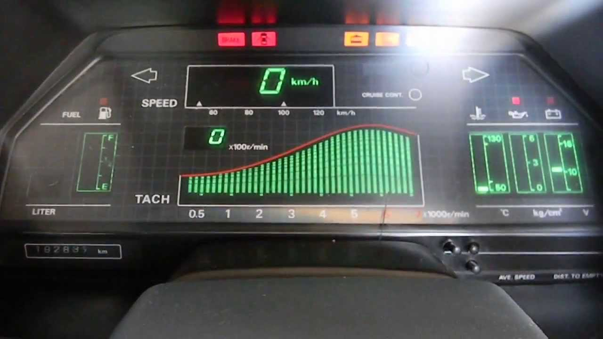
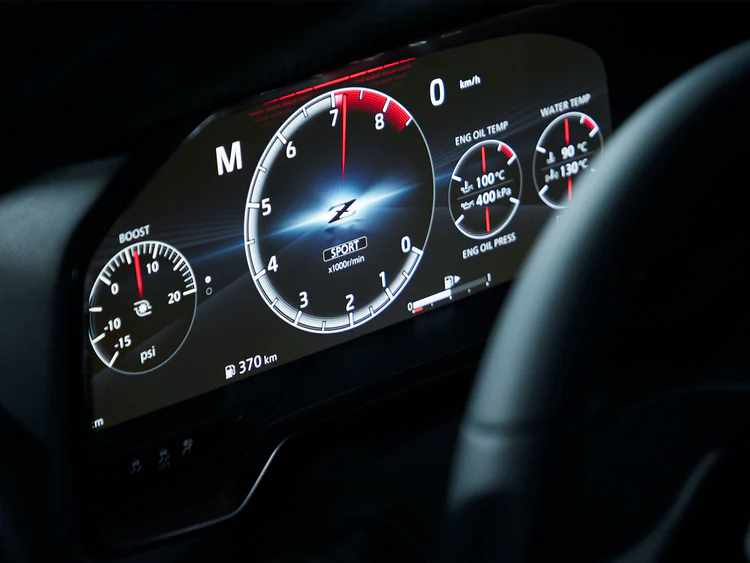
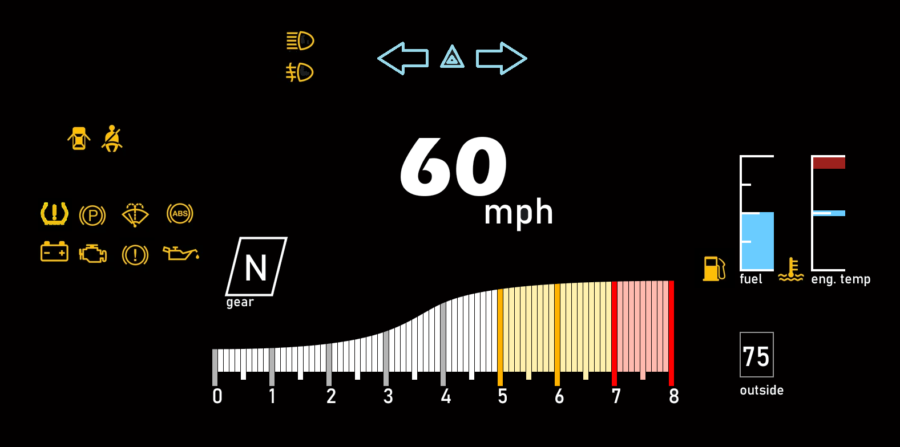

# Christopher Bednarz - CS 4331 - Project 2

# Description

This is a touchscreen interface for a microwave, first showing an example of a bad one and then an example of a good one.

## Project link
(Project 2 - Digital) (https://thetomzest.github.io/p2ChristopherBednarz/)

## Dashboard Design Analysis

### Alfa Romeo 90

Pros: 
-Speedometer is large and visible from a distance.

Cons:
-Digital speedometer may be hard to read.
-Grid lines add to the clutter and don't really serve a purpose.
-Number spacing is very tight.
-Second speedometer's number spacing is very tight and may be hard to read at a glance.
-The larger numbers detract from the smaller ones that may be barely notced.

### Corvette C4

Pros:  
-Speedometer and Tachometers are clearly visible.  
-Again, uses digital gauges, but makes them somewhat large.  
-Indicators are clear and separated from other gauges.  

Cons:  
-Middle panel is very hard to read.  
-Sun glare may be an issue with a yellow light.  

### Toyota Corolla GT-S

Pros:  
-Large speedometer taking up most of the space.  
-Fuel and Temp are easy to read and aren't crowded by other gauges.  
-Tachometer lights up with a different color when at round numbers.  

Cons:  
-Gauges at the bottom, what do they mean? Seem to be odometer, but why are 2 of them needed?  
-Tiny lines may be unneccessary inbetween each round number on tachometer.  
-What does the light next to speed mean?  
-Indicators are very far apart an not in symmetrical places.  

### Lamborghini Aventador

Pros:  
-Tachometer is easy to read.  

Cons:  
-Almost everything else is so incredibly small or cluttered they're hard to read.  
-Speedometer is especially an offender.  
-Date and time are very squished together.  
-Side gauges are extremely small.  
-0 on tachometer blends in with odometer (though relatively unharmful).  
-Lots of unused space as well that many of these issues could be resolved by using.  

### Nissan z31

Pros:  
-Overall has kept everything to the bare essentials.  
-Large and readable speedometer.  
-Other gauges are easy to read.  
-Group formation is very good.  

Cons:  
-Speedometer underneath has very tiny numbers, and not sure what triangles represent.  
-Tachometer is very weird and may lend itself to being misread.  
-Not clear that the number above tachometer is rpm without seeing car being driven.  

### Nissan z35

Pros:  
-Tachometer and Speedometer are large and easy to read.  
-Temperature gauges have precise read-outs.  
-Gear selector is easy to see.  
-Very little clutter.  

Cons:  
-Fuel gauge may be too small.  
-"Z" logo is very bright in contrast with the background.  

## Dashboard Usage

The most common usages of a dashboard are checking speed, fuel, and rpm, with the last one being more common with manual transmissions. Rarer use cases would be checking mileage, car temps, and cruise control. In addition to reading these meters, the user will sometimes need to change something, such as changing whether range, mpg, or trip mileage is displayed, or setting cruise control.  

 These should be some of the easieset to read at a glance, however, this isn't always the case, as some dashboards may make reading these gauges hard with smaller numbers or in spots that aren't easy to glance at.
 As well, user controls may not always be the most intuitive. For instance, on many vehicle, in order to reset a trip tracker, 
 you have to hold down the display button, however this isn't always communicated in an easiy understood way. As well, cruise control falls into the same problem and may not be easy to understand.

## New Design

I've chosen to, rather than make a one size fit all gauge cluster, make one for a specific car. I'm actually quite a fan of the Nissan Z series,
and the latest gen (z35) is coming out in a year. The car looks great and has an all digital gauge cluster (seen above), which works well and is easy to read, but I can't help but
feel like it is too bland and generic for such an iconic car, especially with previous generations (like the z31) having a much more interesting gauge cluster.
Thus, I've decided to try my hand at retaining the original styling of the z31's while incorporating features of the z35 and other modern cars.

For the new design. I've implemented a digital speedometer and a tachometer which are both functional and stylish.
The font type I've chosen for the speedometer I've chosen for its easy readability, but more noticeably, there is no traditionally
styled radial speedometer, it is purely a digital one. This clears the screen of unneccessary clutter and allows more room for the digital speedometer to take up more space
while presenting a sleek modern looking design for a new age.
As well, the tachometer is not a traditional radial style instead a linear one, one that I intentionally designed to mimick the Nissan z31.
The tachometer, as it is on a manual sports car, has a yellow and red coloring for higher rpms, representing optimal shifting times,
something that is present on the current z35 design.  

As for diagnostic information, I've grouped all warning lights together in one group and the fuel and engine temperature in another. As well, the turn signals and emergency indicator are all grouped at the top middle.
If there are any warning lights, this makes them stand out more. I've also grouped the more important warning lights together, separate from the lights or seatbelt and door ajar lights.
